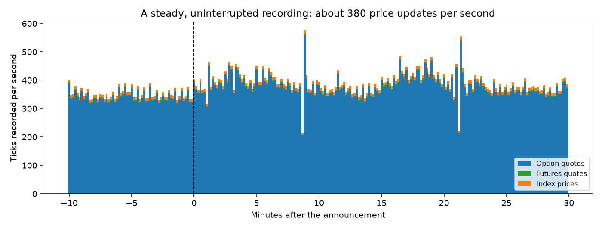
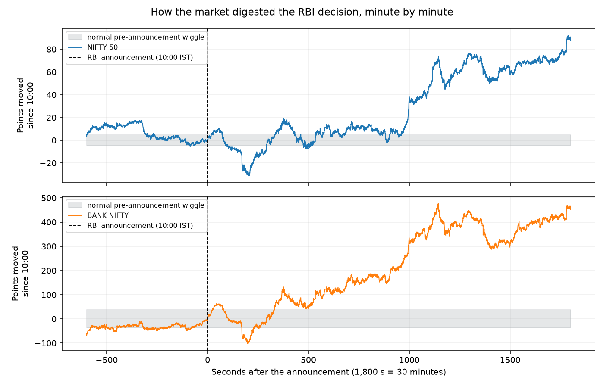
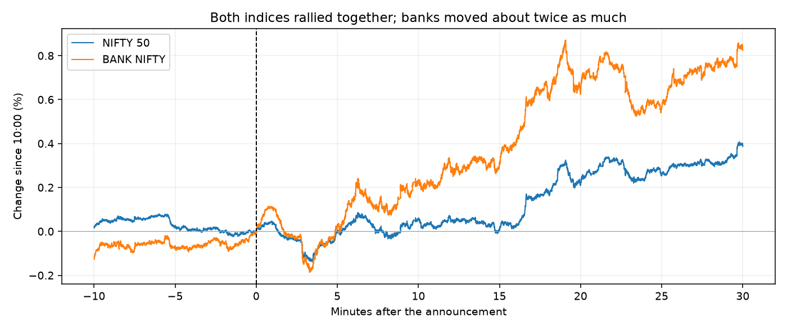
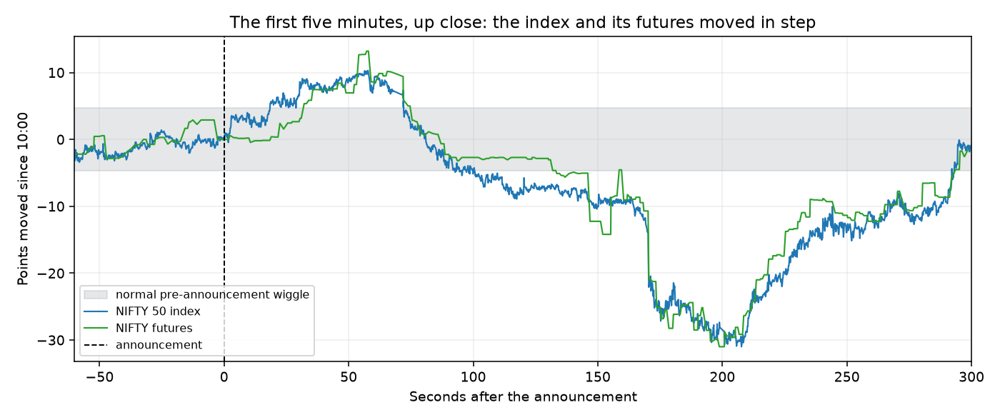
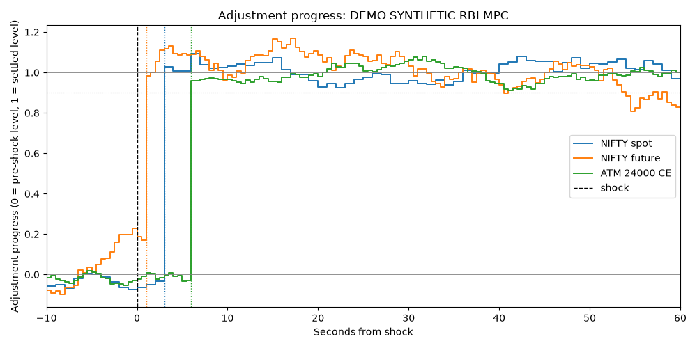
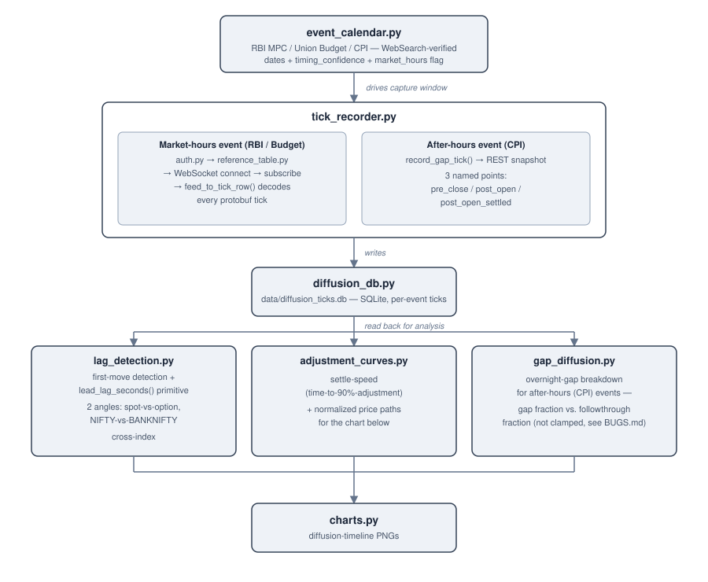

# Information Diffusion Model

**How does the Indian stock market absorb big news? This project records every price update around the RBI's interest-rate announcement and shows how NIFTY, BANK NIFTY, their futures and their options responded, second by second.**

When the Reserve Bank of India announces a rate decision, traders react in several places at once: the index itself, its futures, and thousands of options. This project listens to all of them live, stores every tick, and measures how the news spreads through the market.

It is the "how fast" companion to my [NSE Options Arbitrage Detection Engine](https://github.com/Nukebyt/NSE-Options-Arbitrage-Detection-Engine), which asks "are today's prices consistent with each other?"

---

## The first real event: RBI policy announcement, 7 October 2026, 10:00 IST

I recorded from 09:50 to 10:30 IST: ten minutes before the announcement and thirty minutes after.

### What was captured

| | |
|---|---|
| Price updates recorded | **917,204** |
| Option quotes | 885,596 (about 740 contracts) |
| Index prices (NIFTY 50, BANK NIFTY) | 25,579 |
| Futures quotes | 6,029 |
| Recording gaps | **none** (a single uninterrupted connection) |
| Rate | about 380 updates per second |



*Every bar is ten seconds of recording. The feed was steady the whole way through, so the analysis below rests on complete data.*

### What the market did



*Each line shows how far the index moved from its 10:00 level. The grey band is the normal wiggle seen in the minutes before the announcement.*

In plain terms:

- **The market took the announcement in stride.** In the first minute NIFTY's largest 5-second move was 4.2 points, within the 6.8 points it routinely moved in the quiet minutes before. There was no sudden jump, which fits a decision that markets had largely priced in beforehand.
- **The real move was a steady build.** Over the next half hour NIFTY rose about 90 points (+0.40%) and BANK NIFTY about 460 points (+0.84%).
- **Banks moved about twice as much as the broad index**, which fits how directly banks are tied to interest-rate news.



*Same moves as percentages: the two indices travelled together, with banks amplifying the broad market's direction.*

| Move since 10:00 | After 1 min | 5 min | 10 min | 20 min | 30 min |
|---|---|---|---|---|---|
| NIFTY 50 (points) | +7.5 | -0.9 | +13.0 | +48.6 | **+89.5** |
| NIFTY futures (points) | +8.6 | -1.5 | +12.9 | +58.2 | **+86.7** |
| BANK NIFTY (points) | +59.5 | +13.3 | +128.9 | +347.7 | **+459.6** |
| NIFTY 50 (%) | +0.03% | -0.00% | +0.06% | +0.22% | **+0.40%** |
| BANK NIFTY (%) | +0.11% | +0.02% | +0.24% | +0.64% | **+0.84%** |

### The first five minutes, up close



*The index (blue) and its futures (green) moved together through a small rise, a dip of about 30 points around the three-minute mark, and a recovery. Futures update less often, which is why the green line moves in steps.*

### Checking the method

A measurement tool should be tested against a case where the answer is known. I generated artificial prices with built-in delays (futures react at +1 s, the index at +3 s, the option at +6 s) and ran the same analysis on them:



*Artificial test data, not market data. The analysis recovers the planted order and timing exactly: futures first, index second, option third.*

The same checks run on real data too. They compare each series against its own normal behaviour in a quiet window, which is how the project tells a real reaction from everyday noise. For this event they show that the market responded gradually rather than with one sharp jump, so I report the move as it happened rather than forcing a "who moved first, by how many seconds" headline. A sharper announcement, such as a surprise rate change, gives the timing analysis more to measure, and the same tools are ready for it.

Full numbers: [`docs/results/RBI_MPC_Oct_2026_summary.json`](docs/results/RBI_MPC_Oct_2026_summary.json).

---

## How it works

1. **Pick the moment.** A calendar of scheduled events with exact timestamps: RBI policy decisions (10:00 IST), the Union Budget (11:00 IST), CPI inflation releases (16:00 IST, after the market closes).
2. **Record everything around it.** A live connection to Upstox's market feed records index prices, futures and about 740 NIFTY/BANK NIFTY option contracts for 10 minutes before to 30 minutes after. It reconnects automatically if the network drops.
3. **Measure the response.** For each series: when does it first move outside its normal range, how far does it go, and how long does it take to settle? Comparisons: index vs. futures vs. options, and NIFTY vs. BANK NIFTY. For after-hours releases, how much of the move happened overnight?
4. **Check against controls.** The same measurement runs on quiet "no news" windows, so a real reaction can be told from noise. Pre-agreed analysis settings (fixed before the event) stop the result from being tuned after the fact.



More detail on the method, safeguards and limits: [`docs/METHOD.md`](docs/METHOD.md).

## What's in the project

- **Live recorder** with automatic reconnection, dead-connection detection and gap handling
- **Event calendar** with verified dates (RBI, Budget, CPI)
- **Analysis tools:** first-reaction timing, settle speed, index-vs-futures-vs-options comparison, NIFTY-vs-BANK NIFTY comparison, overnight-gap analysis for after-hours events
- **Safeguards:** control windows, data-gap handling, fixed analysis settings
- **Command-line tool** for event day: `preflight`, `capture`, `analyze`, `report`, `demo`
- **147 automated tests**, many built on artificial data with known answers

## Run it yourself

```bash
python -m venv venv && source venv/bin/activate    # Windows: venv\Scripts\activate
pip install -r requirements.txt
cp .env.example .env     # then add your own Upstox Analytics token (free, read-only)

pytest tests/                                         # 147 tests, no credentials needed
python src/diffusion/diffusion_cli.py demo            # end-to-end demo on artificial data, no credentials needed
python src/diffusion/diffusion_cli.py events          # the event calendar
python src/diffusion/diffusion_cli.py preflight       # live feed check (during NSE trading hours)
python src/diffusion/diffusion_cli.py capture         # record the next market-hours event
python src/diffusion/diffusion_cli.py analyze         # analyse what was captured
python src/diffusion/readme_figures.py                # rebuild the charts above from a captured database
```

Your token stays in `.env`, which is excluded from git. The recording database is large and also kept out of the repository. Event-day checklist: [`RUNBOOK.md`](RUNBOOK.md).

## What's next

- **More events.** CPI inflation on 12 October (an after-hours release, which tests the overnight-gap analysis for the first time) and the RBI decision on 4 December. Each event adds a data point; patterns need several.
- **A timing method that works on gradual moves.** Cross-correlation of second-by-second returns can measure lead-lag across the whole window, not only at a sharp jump.
- **Control days.** More no-news recordings to sharpen the picture of normal behaviour.

## Notes and limits

- One event is one data point. The results describe this announcement and are not a general rule about the market.
- Data comes from one broker's feed (Upstox) of NSE, timestamped on arrival, which is accurate to roughly a second and well suited to the minute-scale moves seen here.
- Everything is read-only: the project records and analyses prices and never places orders.

## Repository guide

```
├── README.md            this file
├── docs/                method write-up, architecture diagram, charts, result summary
├── RUNBOOK.md           event-day checklist
├── BUGS.md              dated log of design decisions and problems found and fixed
├── ROADMAP.md           build plan and status
├── src/data/            Upstox connection (auth, REST, WebSocket subscribe, protobuf decoder)
├── src/diffusion/       calendar, recorder, database, analysis, charts, command-line tool
└── tests/               147 tests
```

---

*Author: Priyanuj Boruah ([Nukebyt](https://github.com/Nukebyt)). Companion project: [NSE Options Arbitrage Detection Engine](https://github.com/Nukebyt/NSE-Options-Arbitrage-Detection-Engine).*
